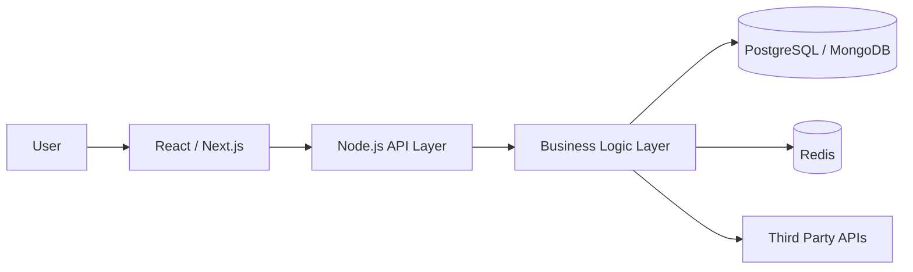
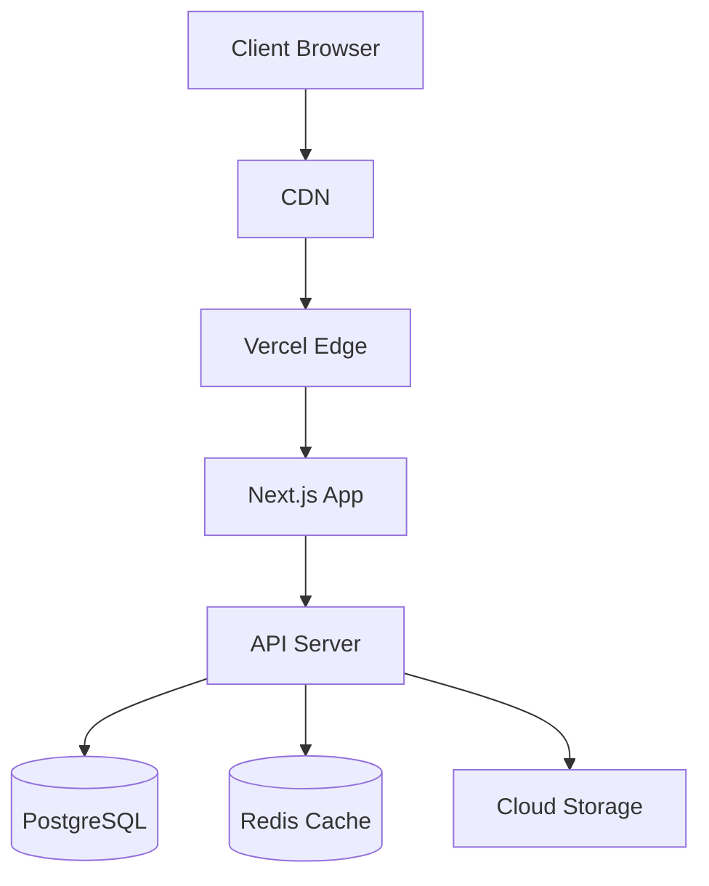

# 👨‍🚀 Farhan Shahriar

<p align="center">

</p>

---

# 🌌 About Me

```txt
Name: Farhan Shahriar
Role: Full Stack Developer
Location: Bangladesh
Focus: Scalable Web Applications
Philosophy: Simplicity + Performance + Maintainability
```

I build **modern full-stack applications** focused on:

- ⚡ Performance  
- 🧠 Clean architecture  
- 🧩 Scalable systems  
- 🔒 Production-grade engineering  

---

# 🌐 Connect With Me

<p align="center">

<a href="https://linkedin.com/in/farhan-shahriar1">

</a>

<a href="https://facebook.com/farhan.shahriar.5264">

</a>

<a href="https://instagram.com/_farhaaannn___">

</a>

<a href="https://x.com/FarhanShah29986">

</a>

</p>

---

# ⚙️ Tech Stack

### Languages


### Frontend


### Backend


### Databases


### Cloud & DevOps


---

# 🧠 Architecture Mindset



**Engineering Principles**

- Clean Architecture  
- Separation of Concerns  
- Domain-Driven Design  
- Performance-First Systems  
- Secure API Design  

---

# 🚀 Featured Projects

### 🛒 Multi-Tenant E-Commerce Platform

Production-grade marketplace architecture.

Features:

- Multi-vendor system  
- Product catalog architecture  
- Secure checkout  
- Role-based access control  
- Scalable database design  

Tech Stack

```
Next.js
Node.js
PostgreSQL
Prisma
Docker
```

---

### 📋 Smart Task Manager

Modern productivity system.

Features:

- Task prioritization  
- Real-time search  
- Drag-and-drop workflow  
- Clean UI/UX  

Tech Stack

```
React
Redux
Tailwind
Node.js
MongoDB
```

---

# 📦 Production Stack



---

# 📊 GitHub Analytics

<p align="center">


</p>

<p align="center">


</p>

---

# 🐍 Contribution Snake

<p align="center">


</p>

---

# 🧑‍💻 Developer Philosophy

```
Great software is engineered.

Readable code > Clever code
Simple architecture > Overengineering
Consistency > Trends
Performance > Bloat
```

---

# 📈 Profile Views

<p align="center">


</p>

---

# ✨ Dev Quote


---

# 🤝 Open For Collaboration

Interested in collaborating on:

- Full-Stack SaaS Products  
- Open Source Tools  
- Scalable Backend Systems  
- Startup Projects  

If you're building something exciting — **let's connect.**

---

⭐ *Programs must be written for people to read, and only incidentally for machines to execute.*
